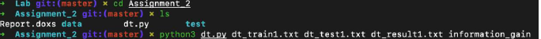

# Build a decision tree, and classify the test set using it

## 1. Summary of Algorithm
In the main function, read train file and store data following below types.

- CLASS_NAME : the name of class label attribute (ex: ‘Class:buys_computer’)
- ATTR_NAME : a list of attribute names (ex: [‘age’, ‘income’, ‘student’, ‘credit_rating’])
- CLASS_VALUES_IDX : a dictionary having name and index of class values
(ex : {‘no’ : 0, ‘yes’ : 1})
- ATTR_IDX : a dictionary having name and index of attributes
(ex : {‘age’ : 0, ‘income’ : 1, ‘student’ : 2, ‘credit_rating’ : 3})
- ATTR_VALUES_IDX : a dictionary having name and index of attribute values
(ex: {‘age’ : {‘<=30’ : 0, ’31…40’: 1, ‘>40’ : 2}, ‘income’: …})
- Data : a list of training tuples (ex : [[‘<=30’, ‘high’, ‘no’, ‘fair’, ‘no’], […],])

And then, run function ‘generate_decision_tree’ to create a training model and run ‘test_and_create_output’ to get class label of test data by using the model and write result of data into result file.

## 2. Description of function
### A. Class Node

 It is a class for node of decision tree.

 It has 4 variables.

- `name` : a name of attribute on node.
- `branch` : a list of branches having outcomes linked to children.
  ex) branch = [{‘low’}, {‘medium’, ‘high’}]
- `children` : a dictionary having index which is same with the index order of ‘branch’ as keys and instance of children Node as values.
  ex) children = {0 : ‘unacc’, 1: ‘good’} // Child node having {‘medium’, ‘high’} outcome is children[1], ‘good’.
- `is_leaf` : a bool variable that shows whether it is a leaf or not.

It has 3 methods.
- `set_root` is a method to set corresponding node as a question node(attribute node). It sets `name` as attribute name, `branch` as the list of outcomes of attribute(ex : [‘small’, ‘medium’, ‘big’]), `children` as a instance of class Node.
- `set_child` is a method to set children to corresponding node. It initializes `children` to Node instances according to the index of branch having outcome.
- `set_leaf` is a method to set corresponding node as leaf node. It initializes `is_leaf` as True, and ‘name’ as the name of class label.

### B. Function `generate_decision_tree(data, attr_list, method)`

It takes data of training tuples, a list of attributes that is candidates of splitting criterion, and an option of method that is the way to select splitting criterion as inputs.

Before deciding splitting criterion of node, it checks whether all of data has same class label using function `get_unified_class_in_data`. If `get_unified_class_in_data` returns some class_label, it means all of data has same class label so that it sets corresponding node as a leaf node indicating that class_label and returns node.

In addition to this, it checks whether a list of attributes is empty or not. If a list of attributes is empty, it sets corresponding node as a leaf node indicating the majority class in data according to function `get_majority_class` and returns node.

And then, it gets an attribute for splitting criterion and outcomes of this attribute using `get_splitting_criterion`, and it sets corresponding node as a root node.

If method is information_gain or gain_ratio, selected splitting criterion is removed from a list of attribute because it isn’t needed.

It gets each data that has each outcome of splitting criterion. If there is no data that has outcome, corresponding node is set as a leaf node indicating the majority class in those data and returned. Or not, the children nodes is added to the node calling `generate_decision_tree` recursively.

Finally, the function returns a node that is created.

### C. Function `get_unified_class_in_data(data)`

It takes data of training tuples as input.

It returns the value of class label that is exist alone in training tuples if it has, or not, returns empty string.

### D. Function `get_majority_class(data)`

It takes data of training tuples as input.

It returns the value of class label that has the majority in data by scanning the number of each class label value in data .

### E. Function `get_splitting_criterion(data, attr_list, method)`

It takes data of training tuples, a list of attributes that is candidates of splitting criterion, and an option of method that is the way to select splitting criterion as inputs.

It gets splitting_criterion and the outcomes of it by calling function `information_gain` or `gini_index`.

### F. Function `information_gain(data, attr_list, method)`

It takes data of training tuples, a list of attributes that is candidates of splitting criterion, and an option of method that is the way to select splitting criterion as inputs.

At first, it calculates the length of data and the entropy of data using `get_len_tuple_and_base_entropy` And then, it calculates the base entropy for each attribute in the list of attributes using `get_len_tuple_and_base_entropy` and calculates entropy of each attribute. It also calculates split information to get gain ratio.

After getting all of entropy for each attribute, it gets maximum entropy by comparing gain entropy if method is `information gain` or by comparing gain ratio if method is `gain ratio` and returns class label of it.

### G. Function `get_len_tuple_and_base_entropy / gini`
It takes data of training tuples, attribute that is wanted to be calculated, and values of this attribute as input.

It creates a list that stores the number of training tuples having each class value. And it scans the number of trainining tuple for each class value and gets entropy or gini and returns it.

### H. Function `gini_index(data, attr_list)`
It takes data of traing tuples and a list of attributes that is candidates of splitting criterion as input.

At first, it calculates the length of data and the gini index of data, and the base gini index for each attribute in the list of attributes using `get_len_tuple_and_base_gini`. And it calculates gini index of each attribute, and gets the best gini index and returns the class label of it.

### I. Function `Get_data_having_outcome(data, splitting_criterion, outcome, method)`
It takes data of training tuples, splitting_criterion, and outcome of it, and method as input.

It returns the list of data that has outcome of splitting_criterion in total data

### J. Function `est_and_create_output(dt_test, dt_result, model, method)`
It takes test_file, result_file, training model and method that is a way to select splitting criterion as input.

It reads data from test_file and gets class label for each data one by one using `get_class_label_using _model` function. And then, it creates appropriate result combined attribute values and class label and writes it into output file.

### K. Function `get_class_label_using_model(data, model, method)`
It takes data that is wanted to be investigated, training model , and method.

It scans training model until it finds class label for data and returns class label.

## 3. How to run code

## 4. Other specification of implementation and testing
I implement decision tree by three method. Information gain, gain ratio, and gini index.

Basically, gini index method is set in my implementation if you do not add any arguments in command as below.

If you add *information_gain* for 5th argument, decision tree would be implemented by information gain method. See below.

If you add *gain_ratio* for 5th argument, decision tree would be implemented by gain_ratio method. See below.

In case of second data set(Car_evaluation), gini index method is more accurate than the others so that’s why I set gini index method as default method.

If you evaluate my program with other datasets, please run the command without method argument for testing accuracy of “gini_index” and please try command with method argument(“information_gain” or “gain_ratio”) to check the accuracy of those two method. And please select the best method with the best accuracy for evaluating my program. Thank you.
